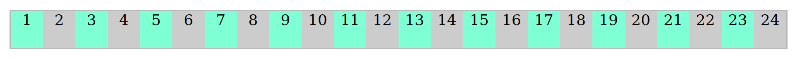

# FLox

[Descargar Flox](https://raw.githubusercontent.com/ssaurexd/flox/master/flox.css)
[Descargar Flox Minificado](https://raw.githubusercontent.com/ssaurexd/flox/master/flox.min.css)


_____________________________________

## Grid



```<main class="main" >
	<div class="row ">
		<div class="col-1">Grid 1 </div>
		<div class="col-1">Grid 2 </div>
		<div class="col-1">Grid 3 </div>
		<div class="col-1">Grid 4 </div>
		<div class="col-1">Grid 5 </div>
		<div class="col-1">Grid 6 </div>
		<div class="col-1">Grid 7 </div>
		<div class="col-1">Grid 8 </div>
		<div class="col-1">Grid 9 </div>
		<div class="col-1">Grid 10 </div>
		<div class="col-1">Grid 11 </div>
		<div class="col-1">Grid 12 </div>
		<div class="col-1">Grid 13 </div>
		<div class="col-1">Grid 14 </div>
		<div class="col-1">Grid 15 </div>
		<div class="col-1">Grid 16 </div>
		<div class="col-1">Grid 17 </div>
		<div class="col-1">Grid 18 </div>
		<div class="col-1">Grid 19 </div>
		<div class="col-1">Grid 20 </div>
		<div class="col-1">Grid 21 </div>
		<div class="col-1">Grid 22 </div>
		<div class="col-1">Grid 23 </div>
		<div class="col-1">Grid 24 </div>
	</div>
</main>
```